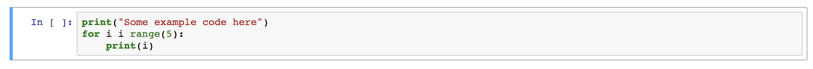

# Requirements

The course can be completed with either Python or R. If you have any previous programming experience with one or both of them, it is recommended to choose the language you are more comfortable using. 

!!! warning 
    If you are using a computer (i.e. laptop from your employer), in which you don't have administrative rights to install software, please refer to section Programming on the cloud or contact your organization's IT-helpdesk to help you with installations.

## Option A: Python

!!! tip
    Recommended for first time programmers.

1. Install [Anaconda](https://www.anaconda.com/products/distribution) with Python 3.9.
2. Follow up installation instructions and start [Jupyter Notebook](https://jupyter.org/) from Anaconda settings.
3. If this is your first time with notebooks, check section [Brief introduction to notebooks](#brief-introduction-to-notebooks) below.

## Option B: R and RStudio

!!! tip
    Recommended for people with some previous experience with R.

1. Install **both** [R](https://www.r-project.org/) and [RStudio](https://www.rstudio.com/). 
2. If this is your first time launching RStudio, check this [introduction to the interface](https://www.r4epi.com/navigating-the-rstudio-interface.html) from the book  [R for Epidemiology](https://www.r4epi.com/) by Brad Cannell.

## Short tutorials
    
### Programming on the cloud

In case you problems to install software, use following online versions:

1. [University of Helsinki Virtual Desktop Environment](https://vdi.helsinki.fi/) 
    - desktop environment that with preinstalled softwars
2. [CSC Notebooks](https://notebooks.rahtiapp.fi/welcome) 
    - Login with your HAKA credidentials.
    - Create an instance of "Course Introduction to Python (self-study)" and a notebook there. 
    - Remember to always save your changes to a local machine: the files in CSC will be destroyed within five hours.

## Brief introduction to notebooks

Juniper Notebooks are convinent and allows data exploration. It is not the only editor available for programming, but fairly popular among researchers. Jupyter can run both Python and R, but not interchangebly at the same time.

Code is written in cells:

Then you can execute the selected cell using the play button (or, if needed, stop execution using the stop button):

A brief introduction how to set up a Jupyter Notebook using Anaconda and how to write new code blocks.

<iframe width="560" height="315" src="https://www.youtube.com/embed/-MyjG00la2k" frameborder="0" allow="accelerometer; autoplay; encrypted-media; gyroscope; picture-in-picture" allowfullscreen></iframe>